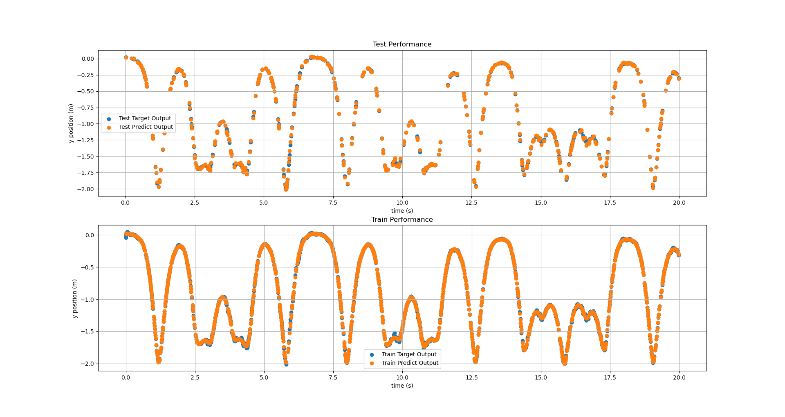
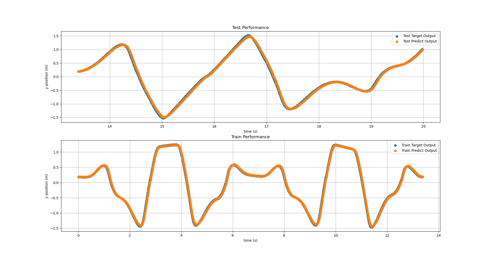

# ML-on-predicting-chaotic-systems
2024.4.23 update: we uploaded our [presentation video](https://youtu.be/QoBRMm2b1gU)
## Requirement
- Keras
- Tensorflow
- sklearn
## Steps
### Step1 Generate Data
First Run `generate_dataset.py` in `\script`
### Step2 Run model and evaluate
Run `LinearRegression.py` or `LSTM.py` in `\script`

### Results
Linear Regression (with map)

LSTM

